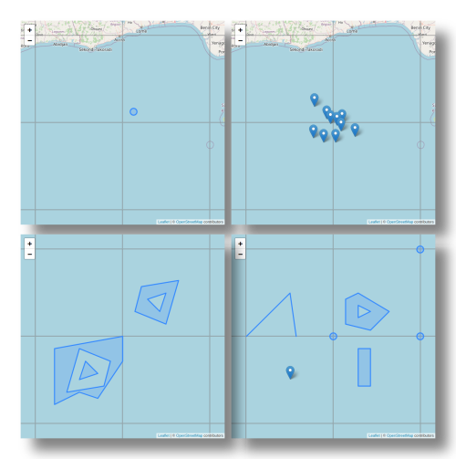

# Academy-Course-DAT31053

**An Introduction to GeoJSON**

This course is a CrashProgram (short course) introducing the GeoJSON format for working with geographical data. The course is at an introductory technical level. It requires some familiarity with data specifications such as JSON and a very basic knowledge of Python

## Course objectives

* You will be able to confidently discuss the geojson standard 
* You will be able to dive into geojson related development projects with confidence

The course is live at the [Open Risk Academy](https://www.openriskacademy.com/course/view.php?id=53), this repository  hosts the python scripts used in the course. The scripts can be used standalone but documentation is minimal

## Brief Description 

* Step 1: In this first step of the course we start with a high level review of GeoJSON
* Step 2: In this step we review the elements of the GeoJSON specification in some detail with examples
* Step 3: In this step we will go over the _basics_ of using geojson in python
* Step 4: In this final step we cover a number of special topics that are quite useful to be aware of

#### Where To Get Help:

If you get stuck on any issue with the course or the Academy:

- If the issue is related to the course topics / material, check in the first instance the Course Forum (Chat)
- Join the course discussion in the [Open Risk Commons](https://www.openriskcommons.org/t/intro-to-geojson/65)
- If the issue is related the operation of the Open Risk Academy check first the Academy FAQ
- If the issue persists contact us at info at openrisk dot eu

## Academy Course Catalog

* [Course List and Description](https://www.openriskmanagement.com/academy-courses/)
 

